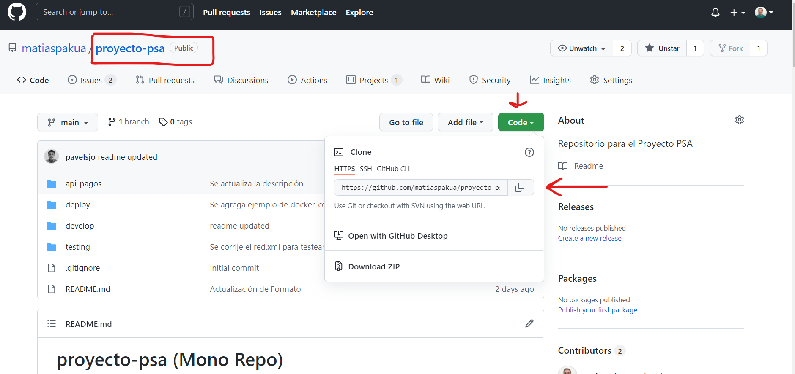
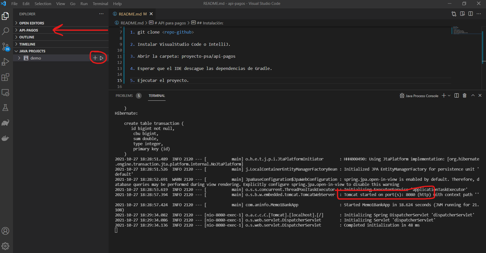
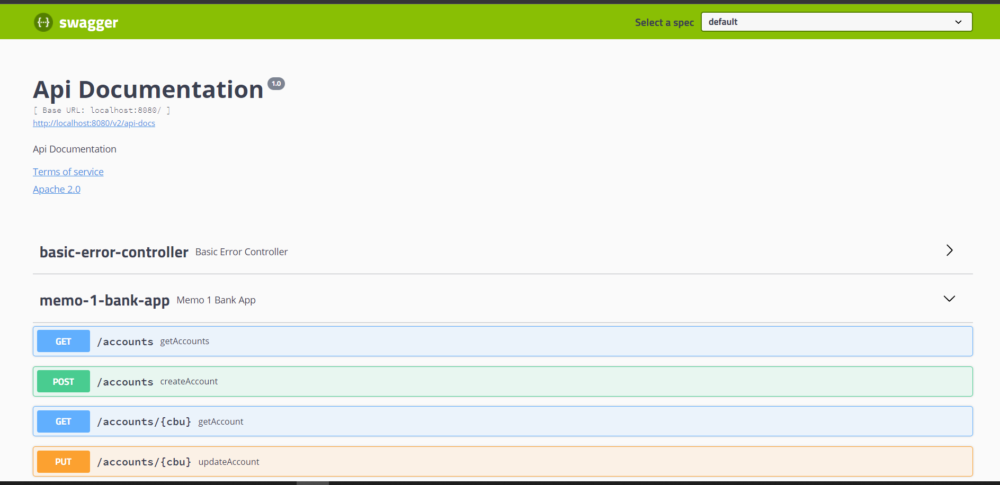

# API para pagos

Backend API de pagos.

## Instalación:

1. git clone <repo-github>:

 

2. Instalar VisualStudio Code o IntelliJ.

3. Abrir la carpeta: proyecto-psa/api-pagos

4. Esperar que el IDE descague las dependencias de Gradle.

5. Ejecutar el proyecto. ver imagen:

 

6. Abir en el navegar/browser: localhost:8080

```bash
{
  "_links" : {
    "transactions" : {
      "href" : "http://localhost:8080/transactions"
    },
    "accounts" : {
      "href" : "http://localhost:8080/accounts"
    },
    "profile" : {
      "href" : "http://localhost:8080/profile"
    }
  }
}
```

7. Verificar endpoints disponibles con Swagger: http://localhost:8080/swagger-ui.html

 
