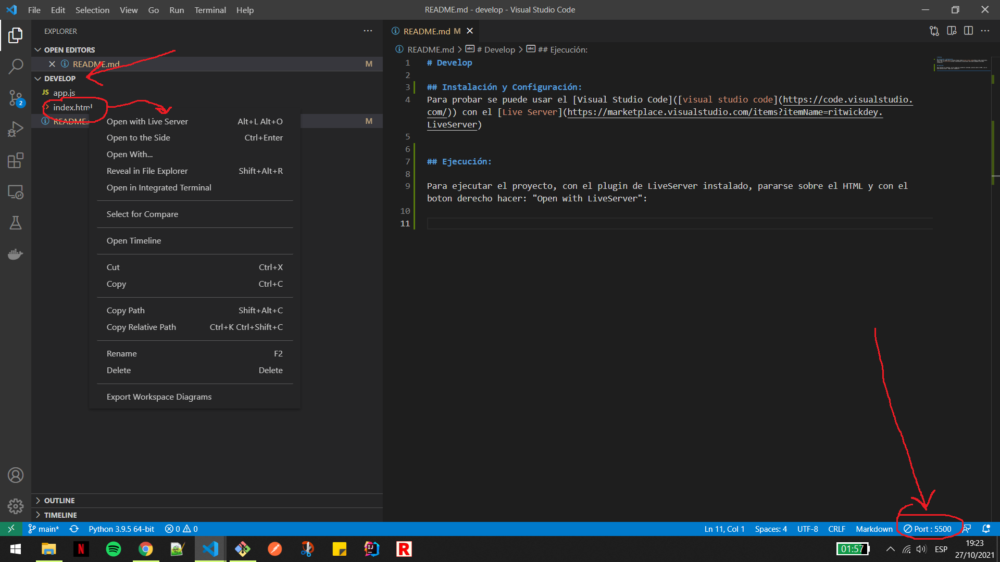
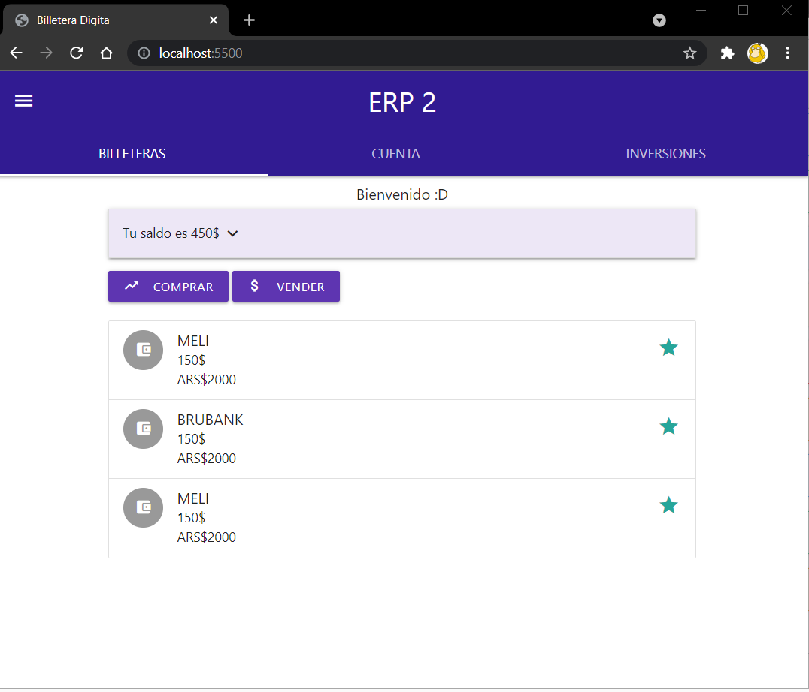

# Develop

## Instalación y Configuración: 
Para probar se puede usar el [Visual Studio Code]([visual studio code](https://code.visualstudio.com/)) con el [Live Server](https://marketplace.visualstudio.com/items?itemName=ritwickdey.LiveServer)

## Ejecución:

1. Para ejecutar el proyecto, con el plugin de LiveServer instalado, pararse sobre el HTML y con el boton derecho hacer: "Open with LiveServer":

 

2. Verificar en el navegador: **localhost:5500**

 